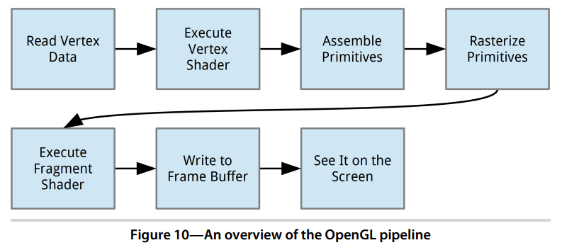

# Learning OpenGL

</br>
</br>

# Base app - Full red screen

## Why Do We Need to Continually Clear the Screen?

Back in the days when everything was rendered in software, it usually was wasteful
to clear the screen. Developers would optimize by assuming that everything would
get painted over, so there would be no need to wipe away stuff from the previous
frame. They did this to save processing time that would otherwise have been wasted.
This sometimes led to the famous “hall of mirrors” effect, as seen in games such as
Doom: the resulting visual effect was like being in the middle of a hall of mirrors,
with old content repeated over and over.

This optimization is no longer useful today. The latest GPUs work differently, and
they use special rendering techniques that can actually work faster if the screen is
cleared. By telling the GPU to clear the screen, we save time that would have been
wasted on copying over the previous frame. Because of the way that GPUs work today,
clearing the screen also helps to avoid problems like flickering or stuff not getting
drawn. Preserving old content can lead to unexpected and undesirable results.

</br>
</br>

## TextureViews

Behind the scenes, a GLSurfaceView actually creates its own window and punches a
“hole” in the view hierarchy to allow the underlying OpenGL surface to be displayed.
For many uses, this is good enough; however, since the GLSurfaceView is part of a separate window,
 it doesn’t animate or transform as well as a regular view.

Starting with Android 4.0 Ice Cream Sandwich, Android provides a TextureView that
can be used to render OpenGL without having a separate window or hole punching,
which means that the view can be manipulated, animated, and transformed as well
as any regular Android view. Since there’s no OpenGL initialization built into the
TextureView class, one way of using a TextureView is by performing your own OpenGL
initialization and running that on top of a TextureView; another is to grab the source
code of GLSurfaceView and adapt it onto a TextureView.

</br>
</br>

## Renderer Class

Now we’re going to define a Renderer so that we can start clearing the screen.
Let’s take a quick overview of the methods defined by the Renderer interface:

### onSurfaceCreated(GL10 glUnused, EGLConfig config): 
  
GLSurfaceView calls this when the surface is created. This happens the first
time our application is run, and it may also be called when the device
wakes up or when the user switches back to our activity. In practice, this
means that this method may be called multiple times while our application
is running. 

### onSurfaceChanged(GL10 glUnused, int width, int height):

GLSurfaceView calls this after the surface is created and whenever the size
has changed. A size change can occur when switching from portrait to
landscape and vice versa.

### onDrawFrame(GL10 glUnused):

GLSurfaceView calls this when it’s time to draw a frame. We must draw
something, even if it’s only to clear the screen. The rendering buffer will
be swapped and displayed on the screen after this method returns, so if
we don’t draw anything, we’ll probably get a bad flickering effect.

### unused arguments:

What’s going on with those unused arguments of type GL10? This is a vestige
of the OpenGL ES 1.0 API. We would use this parameter if we were writing
an OpenGL ES 1.0 renderer, but for OpenGL ES 2.0, we call static methods
on the GLES20 class instead.

</br>
</br>

## Rendering in a Background Thread

The renderer methods will be called on a separate thread by the GLSurfaceView. The
GLSurfaceView will render continuously by default, usually at the display’s refresh rate,
but we can also configure the surface view to render only on request by calling
GLSurfaceView.setRenderMode(), with GLSurfaceView.RENDERMODE_WHEN_DIRTY as the argument.
Since Android’s GLSurfaceView does rendering in a background thread, we must be
careful to call OpenGL only within the rendering thread, and Android UI calls only
within Android’s main thread. We can call queueEvent() on our instance of GLSurfaceView
to post a Runnable on the background rendering thread. From within the rendering
thread, we can call runOnUIThread() on our activity to post events on the main thread.

</br>
</br>


# Defining Vertices and Shaders 

build objects by using a set of independent points known as **vertices**,

draw these objects by using **shaders**, small programs that tell OpenGL how to draw an object. 

# vertices

Before we can draw our table to the screen, we need to tell OpenGL what to
draw.

The triangle is the most basic geometric shape around. We see it everywhere
in the world, such as in the structural components of a bridge, because it is
such a strong shape. It has three sides connected to three vertices. If we took
away one vertex, we’d end up with a line, and if we took away one more, we’d
have a point.

## The Winding Order of a Triangle

You might notice that when we define our triangles we order the vertices in counterclockwise order; this is known as the winding order. When we’re consistent in using
the same winding order everywhere, we can often optimize performance by using the
winding order to figure out if a triangle belongs to the front or to the back of any
given object, and then we can ask OpenGL to skip the back triangles since we won’t
be able to see them anyway.

## Java does not like OpenGL

We’ve finished defining our vertices, but we need to do an extra step before
OpenGL can access them. The main problem is that the environment where
our code runs and the environment where OpenGL runs don’t speak the same
language.

There are two main concepts that we need to understand:

1. When we compile and run our Java code in the emulator or on a device,
it doesn’t run directly on the hardware. Instead, it runs through a special
environment known as the Dalvik virtual machine. Code running in this
virtual machine has no direct access to the native environment other than
via special APIs.

2. The Dalvik virtual machine also uses garbage collection. This means that
when the virtual machine detects that a variable, object, or some other
piece of memory is no longer being used, it will go ahead and release that
memory so that it can be reused. It might also move things around so
that it can use the space more efficiently.

The native environment does not work the same way, and it will not expect
blocks of memory to be moved around and freed automatically.
Android was designed in this way so that developers could develop applications
without worrying about the particular CPU or machine architecture and
without having to worry about low-level memory management. This usually
works well until we need to interface with a native system such as OpenGL.
OpenGL runs directly on top of the hardware as a native system library.
There’s no virtual machine, and there’s no garbage collection or memory
compaction.

## Solutions

1. Calling Native Code from Java, use the Java Native Interface
(JNI), and this trick is already done for us by the Android SDK guys.

2. Copying Memory from Java’s Memory Heap to the Native Memory Heap, We have access
to a special set of classes in Java that will allocate a block of native memory
and copy our data to that memory. This native memory will be accessible to
the native environment, and it will not be managed by the garbage collector.

```java
vertexData = ByteBuffer
.allocateDirect(tableVerticesWithTriangles.length * BYTES_PER_FLOAT)
.order(ByteOrder.nativeOrder())
.asFloatBuffer();
vertexData.put(tableVerticesWithTriangles);
```

Let’s take a look at each part. First we allocated a block of native memory
using ByteBuffer.allocateDirect(); this memory will not be managed by the garbage
collector. We need to tell the method how large the block of memory should
be in bytes. Since our vertices are stored in an array of floats and there are
4 bytes per float, we pass in tableVerticesWithTriangles.length * BYTES_PER_FLOAT.

The next line tells the byte buffer that it should organize its bytes in native
order. When it comes to values that span multiple bytes, such as 32-bit
integers, the bytes can be ordered either from most significant to least significant or from least to most.
 Think of this as similar to writing a number either
from left to right or right to left. It’s not important for us to know what that
order is, but it is important that we use the same order as the platform. We
do this by calling order(ByteOrder.nativeOrder()).

Finally, we’d rather not deal with individual bytes directly. We want to work
with floats, so we call asFloatBuffer() to get a FloatBuffer that reflects the underlying
bytes. We then copy data from Dalvik’s memory to native memory by calling
vertexData.put(tableVerticesWithTriangles). 

The memory will be freed when the process gets destroyed, 
so we don’t normally need to worry about that. If you end up
writing code that creates a lot of ByteBuffers and does so over time, you may
want to read up on heap fragmentation and memory management techniques.


# Shaders

those shaders tell the graphics processing unit (GPU) how to draw our data. There
are two types of shaders, and we need to define both of them before we can
draw anything to the screen.

These shaders are defined using GLSL, OpenGL’s shading language. This
shading language has a syntax structure that is similar to C.

1. A vertex shader generates the final position of each vertex and is run once per vertex. Once the final positions are known, 
OpenGL will take the visible set of vertices and assemble them into points, lines, and triangles.
2. A fragment shader generates the final color of each fragment of a point,
line, or triangle and is run once per fragment. A fragment is a small,
rectangular area of a single color, analogous to a pixel on a computer screen.

Once the final colors are generated, OpenGL will write them into a block
of memory known as the frame buffer, and Android will then display this
frame buffer on the screen.



We now have shaders to control how each vertex gets drawn to the screen, and we
can also control how each fragment of every point, line, and triangle gets drawn. This
has opened up a new world of possibilities. We can now do per-pixel lighting and
other neat effects, like cartoon-cel shading. We can add any custom effect we dream
up, as long as we can express it in the shader language.

A vec4 is a vector consisting of four components. In the context of a position,
we can think of the four components as the position’s x, y, z, and w coordinates.
 x, y, and z correspond to a 3D position, while w is a special coordinate
that we’ll cover in more detail in Chapter 6, Entering the Third Dimension, on
page 95. If unspecified, OpenGL’s default behavior is to set the first three
coordinates of a vector to 0 and the last coordinate to 1.

Remember that we talked about how a vertex can have several attributes,
such as a color and a position? The attribute keyword is how we feed these
attributes into our shader.

We then define main(), the main entry point to the shader. All it does is copy
the position that we’ve defined to the special output variable gl_Position. Our
shader must write something to gl_Position. OpenGL will use the value stored
in gl_Position as the final position for the current vertex and start assembling
vertices into points, lines, and triangles.

# Fragments

The main purpose of a fragment shader is to tell the GPU what the final color
of each fragment should be. The fragment shader will be called once for every
fragment of the primitive, so if a triangle maps onto 10,000 fragments, then
the fragment shader will be called 10,000 times

## Precision Qualifiers

The first line at the top of the file defines the default precision for all floating
point data types in the fragment shader. This is like choosing between float
and double in our Java code.

We can choose between lowp, mediump, and highp, which correspond to low
precision, medium precision, and high precision. However, highp is only supported in the fragment shader on some implementations.
Why didn’t we have to do this for the vertex shader? The vertex shader can
also have its default precision changed, but because accuracy is more
important when it comes to a vertex’s position, the OpenGL designers decided
to set vertex shaders to the highest setting, highp, by default.

The rest of the fragment shader is similar to the vertex shader we defined
earlier. This time, we pass in a uniform called u_Color. Unlike an attribute that
is set on each vertex, a uniform keeps the same value for all vertices until we
change it again. Like the attribute we were using for position in the vertex
shader, u_Color is also a four-component vector, and in the context of a color,
its four components correspond to red, green, blue, and alpha.
